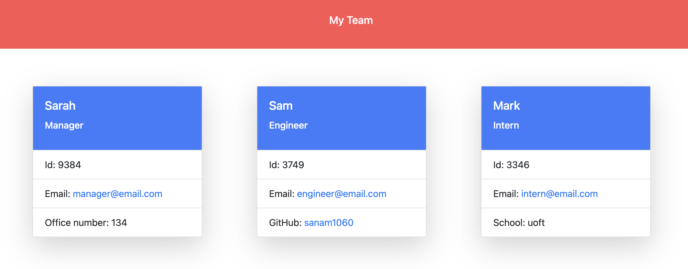

# **_Team Profile Generator_**

## **_Table of contents_**
* [Description of the project](#description-of-the-project)
* [Technologies used](#technologies-used)
* [Screenshot](#screenshot)
* [Installation](#installation)
* [Link URL to GitHub Repository](#link-URL-to-GitHub-repository)

## **_Description of the project_**
This web application gets user input to create an HTML page displaying profiles of the team members.

## **_Technologies used_**
Project is created using:
* HTML
* CSS
* JavaScript
* Nodejs
* Inquirerjs
* TDD (jest tests)
* OOP

## **_Screenshot_**


## **_Usage_**
The final application should work similar to this video: (https://youtu.be/qfjOk5_foMk)

## **_Link URL to GitHub Repository_**
https://github.com/sanam1060/team-profile-generator

## **_Installation_**
1. Clone/download the repository
2. Ensure that you install and use Inquirer version 8.2.4. To do so, use the following command in your project folder:```npm i inquirer@8.2.4```
3. Install package.json with the required dependecies.
4. Run node index.js to launch the app